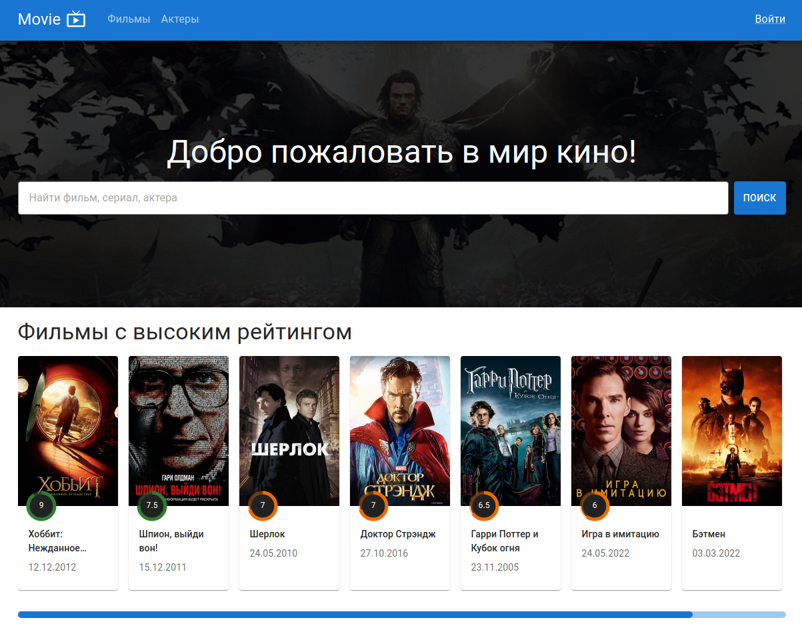

# Frontend для приложения Movie-App

В этом проекте реализована часть функционала сайта [TMDB](https://www.themoviedb.org/) по работе с фильмами, актерами и героями фильмов. 

Проект написан на React на языке typescript. [Backend](https://github.com/khanov26/movie-app-backend) написан на Node.js с использванием фреймвокка Express.

## Демо

Демо версия приложения доступна по [ссылке](https://movie-app-frontend-sigma.vercel.app/).

В системе доступны 3 пользователя:
1. email: `user1@user.com` пароль: `user1` роль: `менеджер`
2. email: `user2@user.com` пароль: `user2` роль: `пользователь`
3. email: `user3@user.com` пароль: `user3` роль: `пользователь`

## Запуск
Чтобы локально запустить сервер, в корне проекта выполните:
1. Создайте файл `.env` со следующим содержимым:
   `REACT_APP_SERVER_URL='***адрес сайта, на котором находится сервер***'`
2. `npm install` - команда установит все зависимости
3. `npm start` - запуститься сервер по адресу [http://localhost:3000](http://localhost:3000).
